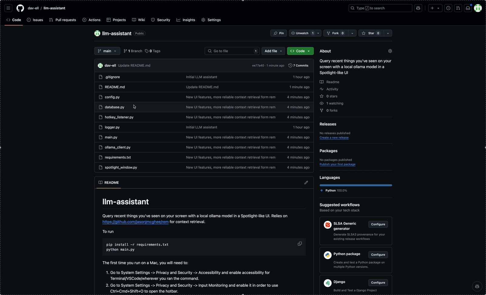

# llm-assistant
Query recent things you've seen on your screen with a local ollama model in a Spotlight-like UI. Relies on [https://github.com/jasonjmcghee/rem](rem) for context retrieval.



To run
```bash
pip install -r requirements.txt
python main.py
```

The first time you run on a Mac, you will need to:

1. Go to System Settings -> Privacy and Security -> Accessibility and enable accessibility for Terminal/VSCode/wherever you ran the command.
2. Go to System Settings -> Privacy and Security -> Input Monitoring and enable it in order to use Ctrl+Cmd+Shift+O to open the hotbar.
